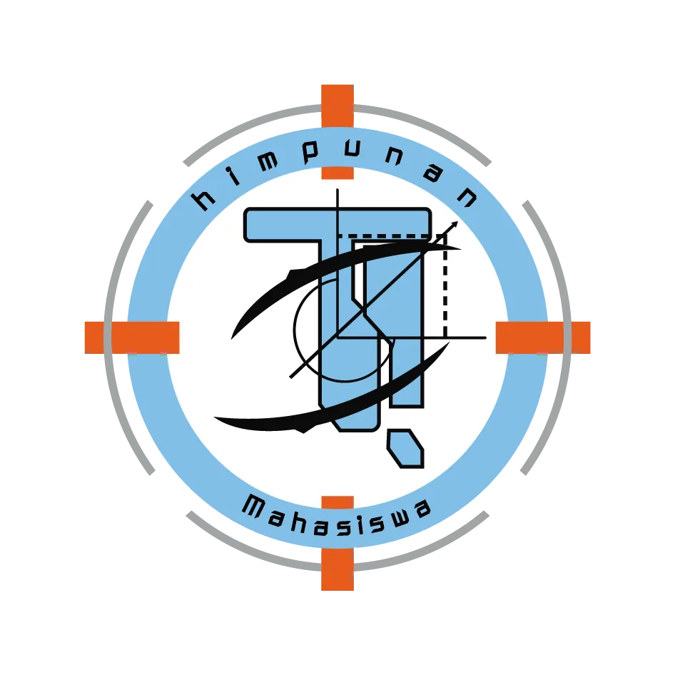

# 🎓 HMPS Project - HIMATIF ENCODER

<div align="center">



**Platform Informasi Resmi Himpunan Mahasiswa Teknik Informatika UIN Malang**
*Periode 2025-2026*

[](https://www.typescriptlang.org/)
[](https://reactjs.org/)
[](https://expressjs.com/)
[](https://www.mongodb.com/)
[](https://tailwindcss.com/)

</div>

---

## 📖 Tentang Project

Project ini adalah **aplikasi web fullstack** yang dibangun untuk Himpunan Mahasiswa Program Studi (HMPS) Teknik Informatika UIN Malang. Aplikasi ini merupakan platform informasi resmi **HIMATIF ENCODER** yang menyediakan berbagai informasi seputar kegiatan, prestasi, dan perkembangan Program Studi Teknik Informatika UIN Malang.

Melalui platform ini, kami berupaya untuk memberikan akses informasi yang **transparan dan terupdate** kepada seluruh mahasiswa Teknik Informatika UIN Malang serta masyarakat umum yang ingin mengetahui lebih lanjut tentang Program Studi Teknik Informatika UIN Malang.

---

## ✨ Fitur Unggulan

<table>
<tr>
<td width="50%">

### 🔐 **Sistem Autentikasi & Autorisasi**
- 👤 Login multi-role
- 🛡️ Manajemen profil pengguna lengkap
- 🔑 Sistem reset password terintegrasi
- 🎫 JWT-based authentication token dengan session tracking & revocation
- 🚧 Role-based access control yang ketat

### 📊 **Dashboard Admin Real-time**
- 📈 Statistik dan analitik kegiatan live
- 👥 Manajemen pengguna advanced
- 🔍 Monitoring aktivitas sistem real-time
- ⚙️ Pengaturan sistem yang fleksibel
- 📝 Log aktivitas terperinci dengan timeline

### 👨‍🎓 **Manajemen Organisasi**
- ➕ Pengelolaan struktur organisasi
- ✅ Sistem verifikasi anggota
- 📚 Riwayat keanggotaan lengkap
- 🏷️ Status dan badge keanggotaan

</td>
<td width="50%">

### 📰 **Sistem Konten & Media**
- 📝 Editor berita dengan TinyMCE WYSIWYG
- 📸 Upload dan manajemen media library
- 🔍 Pencarian konten yang powerful
- 🗃️ Arsip digital terorganisir

### 🎨 **User Experience Modern**
- 📱 Responsive design untuk semua device
- ⚡ Loading yang cepat dengan caching
- 🔔 Notifikasi real-time
- 🎯 Navigation yang intuitif

### 🔧 **Fitur Developer**
- 📚 API documentation lengkap
- 🛠️ Backup otomatis
- 📊 Performance monitoring
- 🔒 Security middleware comprehensive
- 🤖 Integrasi AI Chat (Gemini + tool-calling berbasis permission)

</td>
</tr>
</table>

---

## 🏗️ Arsitektur Teknologi

### 🎨 **Frontend Stack**
```javascript
// Modern React dengan TypeScript
├── React 18 + TypeScript
├── React Query (TanStack Query) - State Management
├── Wouter - Lightweight Routing
├── Radix UI - Accessible Components
├── Tailwind CSS - Utility-first CSS
├── React Hook Form - Form Handling
├── Zod - Schema Validation
├── Lucide React - Beautiful Icons
└── Vite - Ultra Fast Build Tool
```

### ⚙️ **Backend Stack**
```javascript
// Robust Express.js Backend
├── Express.js + TypeScript
├── MongoDB + Mongoose (ODM) - Primary Database
├── JWT (cookie) + session tracking (`sid`) - Authentication & Authorization
├── Multer - File Upload Handling
├── bcryptjs - Password Hashing
├── Nodemailer + OTP - Forgot/Reset Password Flow
├── Helmet/HPP + anti-spoofing + anti-injection - Security Middleware
├── Multi-tenant resolver (`/api/c/:slug/*`) + tenant storage
├── Rate Limiting - API Protection
├── Google Drive integration (api/gdrive) - Media sources
└── ESBuild - Fast Production Build
```

### 🗄️ **Database & Infrastructure**
```javascript
// Scalable Database Design
├── MongoDB - Document Database
├── Mongoose Schemas - Struktur & validasi data
├── Indexes untuk query (contoh: `slug`)
├── Snapshot backup bulanan (cluster backup)
├── Rollback/Restore via OTP (backup restore)
├── Scheduled job (cron) untuk sync & maintenance
└── Isolated tenant databases untuk komunitas
```

---

## 📁 Struktur Project

```
📦 HMPS Project
├── 🎨 client/                     # Frontend React Application
│   ├── 📂 src/
│   │   ├── 🧩 components/        # Reusable UI Components
│   │   │   ├── 🎛️ dashboard/    # Dashboard Components
│   │   │   ├── 🌐 public/       # Public Site Components
│   │   │   └── 🎨 ui/           # Base UI Components (Radix)
│   │   ├── 📄 pages/            # Page Components & Routes
│   │   ├── 🪝 hooks/            # Custom React Hooks
│   │   ├── 🛠️ lib/             # Utility Libraries
│   │   ├── 🎯 utils/            # Helper Functions
│   │   └── 📊 main.tsx          # App Entry Point
├── ⚙️ server/                    # Backend Express Application
│   ├── ⚡ index.ts              # Server Entry Point
│   ├── 🎮 routes.ts             # API Routes Definition
│   ├── 🔐 auth.ts               # Authentication + session logic
│   ├── 🛡️ security.ts          # Helmet/HPP + validation + sanitization
│   ├── 🧠 mongo-storage.ts      # Data access layer (storage)
│   ├── 🧑‍💻 services/          # Business logic (backup, OTP, sync, chat, etc.)
│   ├── 🛠️ middleware/          # Custom security middleware
│   ├── 🌐 routes/              # Modular routes (chat/comments/feedback/sharing)
│   ├── 🧾 upload.ts            # Upload handlers + image processing
│   ├── 📦 models/             # Mongo-related models/schemas
│   └── ⚙️ config/             # External service configs (Gemini keys)
├── 🗄️ db/                       # Database & seeding
│   ├── 🔗 mongodb.ts            # Mongoose connection + schema models
│   ├── 🧾 mongodb-backup.ts    # Backup cluster client (snapshot job)
│   └── 🌱 mongo-seed.ts        # Seed script (contoh: akun default)
├── 🤝 shared/                   # Shared Code (Frontend + Backend)
│   ├── 📝 schema.ts             # Shared Type Definitions
│   ├── 🛠️ utils.ts             # Shared Utilities
│   └── 📎 mediaUtils.ts        # Shared media helpers
├── 🌐 public/                   # Static assets (SEO files, favicon, etc.)
├── 📁 attached_assets/          # Asset yang dipakai di frontend
├── 📦 uploads/                  # Upload hasil proses (image/video)
├── 🧠 db/tenant.ts              # Layer schema & koneksi multi-tenant
└── 🌍 nginx-himatif-encoder.conf # Reverse proxy & hardening production
```

---

## 🚀 Quick Start

### 📋 Prerequisites

Pastikan Anda telah menginstall:
- **Node.js** (v18.0.0 atau lebih tinggi)
- **npm** (lockfile project: `package-lock.json`)
- **MongoDB** (local atau cloud)

### ⚡ Installation

```bash
# 1️⃣ Clone repository
git clone https://github.com/Sadamdi/hmps.git
cd hmps

# 2️⃣ Install dependencies
npm install

# 3️⃣ Setup environment variables
# Buat file `.env` di root project (lihat bagian `🌍 Environment Variables` di bawah)
# Edit `.env` dengan konfigurasi Anda

# 4️⃣ Setup database
npx tsx db/mongo-seed.ts

# 5️⃣ Start development server
npm run dev
```

### 🌍 Environment Variables

```env
# Database
MONGODB_URI=mongodb://localhost:27017/hmps
DISABLE_MONGODB=false

# Opsional: cluster backup untuk snapshot bulanan
# Jika diset, aplikasi akan connect + ping saat startup untuk job snapshot
MONGODB_URI_BACKUP=mongodb+srv://...

# Authentication (JWT)
JWT_SECRET=your-super-secret-jwt-key
JWT_EXPIRY=24h

# OTP / Email (forgot password, change password/email, dan restore backup)
EMAIL=your-email@gmail.com
EMAIL_PW=your-email-password/app-password

# Guest comment/feedback (untuk header `x-guest-key`)
# default: hmps-comment-pepper
GUEST_KEY_PEPPER=hmps-comment-pepper

# Gemini (chat di fitur /api/chat)
# Tambahkan GEMINI_API_KEY_1 … GEMINI_API_KEY_N sesuai kebutuhan.
GEMINI_API_KEY_1=...
GEMINI_API_KEY_2=...
# Opsional: batas indeks slot yang discan (default 100; bisa sampai 1000)
GEMINI_MAX_KEY_SLOTS=100
# Opsional: cooldown ms setelah quota/rate limit per slot (default 90000)
GEMINI_KEY_COOLDOWN_MS=90000

# TinyMCE (editor berita)
VITE_TINYMCE_API_KEY=your-tiny-api-key

# Opsional: Google Drive API service account path
GOOGLE_APPLICATION_CREDENTIALS=./credentials/service-account.json

# Opsional: konfigurasi auto-fill struktur organisasi
ORG_AUTO_FILL_MAX_PDF_PAGES=15

# Opsional (dipakai untuk environment check di beberapa tempat)
NODE_ENV=development
```

---

## 🔧 Available Scripts

| Script | Description | Usage |
|--------|-------------|-------|
| `npm run dev` | 🚀 Start development server | Development |
| `npm run build` | 📦 Build for production | Production |
| `npm start` | ▶️ Start production server | Production |
| `npm run check` | 🔍 TypeScript type checking | Development |
| `npm run generate-sitemap` | 🗺️ Generate sitemap (file) | SEO |
| `npm run generate-favicon` | 🧷 Generate favicon assets | SEO |
| `npm run deploy-seo` | 🚀 Deploy SEO assets | SEO |
 
🌱 Seed database (akun default, kalau koleksi masih kosong): `npx tsx db/mongo-seed.ts`

> ⚠️ Catatan: script SEO lama (`generate-sitemap`, `generate-favicon`, `deploy-seo`) **sudah tidak dipakai di repo ini**.  
> Sitemap sekarang digenerate dinamis via endpoint server `/sitemap.xml`.
---

## 🔐 Security Features

<div align="center">

| Feature | Implementation | Status |
|---------|---------------|--------|
| 🔐 **Authentication (JWT)** | JWT di cookie `authToken` + session check (`sid`) + revocation via `tokenVersion` | ✅ Active |
| 🛡️ **Password Security** | bcryptjs hash | ✅ Active |
| ⛑️ **Security Middleware** | `helmet`/`hpp` + anti-spoofing + anti-DDoS + DNS layer protection | ✅ Active |
| ⏰ **Rate Limiting** | express-rate-limit + limiter khusus (login/upload/OTP) | ✅ Active |
| ✅ **Input Validation** | Zod schema validation (`validateInput`) | ✅ Active |
| 🧼 **Sanitization (anti-XSS sederhana)** | `sanitizeInput` (strip script/javascript handler) | ✅ Active |
| 🔒 **File Upload Security** | allowed mimetype + max 100MB + proses gambar (WebP) | ✅ Active |
| 📝 **Audit Logging** | `securityLogger` + aktivitas dashboard | ✅ Active |

</div>

---

## 📡 Dokumentasi API

Berikut daftar endpoint aktif (method + path) berdasarkan route server saat ini.  
Catatan:
- 🔒 Endpoint tertentu butuh login + permission.
- 👤 Endpoint guest/public tertentu pakai header `x-guest-key`.
- 🏘️ Semua endpoint di bawah juga bisa berjalan pada konteks komunitas via prefix: `/api/c/:slug/...`.

### 🔐 Authentication & Session
- `POST /api/auth/login`
- `POST /api/auth/logout`
- `POST /api/auth/revoke-all-sessions`
- `GET /api/auth/me`
- `GET /api/auth/sessions`
- `POST /api/auth/sessions/revoke`
- `PUT /api/auth/profile`
- `POST /api/auth/change-password`
- `POST /api/auth/change-password/request-otp`
- `POST /api/auth/change-password/confirm`
- `POST /api/auth/forgot-password/request-otp`
- `POST /api/auth/forgot-password/verify-otp`
- `POST /api/auth/forgot-password/confirm`
- `POST /api/auth/change-email/request-otp`
- `POST /api/auth/change-email/confirm`
- `GET /api/auth/permissions`
- `POST /api/auth/refresh-permissions`

### 👤 Users, Roles, Permissions & Divisions
- `GET /api/users`
- `POST /api/users`
- `PUT /api/users/:id`
- `DELETE /api/users/:id`
- `POST /api/users/:id/password`
- `POST /api/users/:id/email`
- `PUT /api/users/:id/role`
- `GET /api/roles`
- `GET /api/roles/levels`
- `GET /api/roles/assignable`
- `POST /api/roles`
- `POST /api/roles/create-with-shift`
- `PUT /api/roles/:id`
- `DELETE /api/roles/:id`
- `GET /api/permissions`
- `POST /api/permissions`
- `POST /api/admin/permissions/recompute-owner`
- `GET /api/divisions`
- `GET /api/divisions/available-positions`
- `POST /api/divisions`
- `POST /api/divisions/copy`
- `PUT /api/divisions/:id`
- `PUT /api/divisions/order`
- `DELETE /api/divisions/:id`
- `GET /api/users/:id/permission-overrides`
- `PUT /api/users/:id/permission-overrides`

### 📰 Berita
- `GET /api/berita`
- `GET /api/berita/manage`
- `GET /api/berita/:id`
- `GET /api/berita/:id/:slug`
- `GET /api/berita/:id([a-fA-F0-9]{24})/:slug`
- `GET /api/berita/slug/:slug`
- `GET /api/berita/:id/events`
- `GET /api/berita/slug/:slug/events`
- `GET /api/berita/:id/related`
- `GET /api/berita/slug/:slug/related`
- `POST /api/berita`
- `PUT /api/berita/:id`
- `DELETE /api/berita/:id`
- `POST /api/berita/:id/copy-to-event`
- `POST /api/berita/:id/attach-event`
- `DELETE /api/berita/:id/attach-event/:eventId`

### 🗃️ Library
- `GET /api/library`
- `GET /api/library/manage`
- `GET /api/library/:id`
- `GET /api/library/slug/:slug`
- `GET /api/library/:libraryId/folder/:folderId/files`
- `POST /api/library`
- `PUT /api/library/:id`
- `DELETE /api/library/:id`

### 🗓️ Events
- `GET /api/event-years`
- `GET /api/event-years/:id/events-count`
- `POST /api/event-years`
- `PATCH /api/event-years/:id`
- `PATCH /api/event-years/:id/activate`
- `PATCH /api/event-years/:id/deactivate`
- `DELETE /api/event-years/:id`
- `GET /api/events/published`
- `GET /api/events/active-home`
- `GET /api/events/by-year/:year`
- `GET /api/events/year/:year/slug/:slug`
- `GET /api/events`
- `GET /api/events/:id`
- `POST /api/events`
- `PATCH /api/events/:id`
- `DELETE /api/events/:id`
- `POST /api/events/:id/copy-to-berita`
- `POST /api/events/:id/attach-berita`
- `DELETE /api/events/:id/attach-berita/:beritaId`

### 🏢 Organization
- `GET /api/organization/periods`
- `POST /api/organization/periods`
- `DELETE /api/organization/periods/:period`
- `GET /api/organization/positions`
- `GET /api/organization/positions/:period`
- `POST /api/organization/positions`
- `POST /api/organization/positions/copy`
- `POST /api/organization/positions/auto-fill`
- `POST /api/organization/structure/copy`
- `POST /api/organization/structure-auto-fill`
- `POST /api/organization/structure-auto-fill/apply`
- `DELETE /api/organization/positions/:period`
- `GET /api/organization/members`
- `GET /api/organization/members/:id`
- `POST /api/organization/members`
- `PUT /api/organization/members/:id`
- `DELETE /api/organization/members/:id`

### 👨‍🎓 Prodi & Akademik
- `GET /api/prodi`
- `GET /api/prodi/preview`
- `GET /api/prodi/manage`
- `GET /api/prodi/curriculum/:year`
- `PUT /api/prodi/manage`
- `POST /api/prodi/curriculum/year`
- `POST /api/prodi/upload/photo/member`
- `POST /api/prodi/upload/photo/lab`
- `POST /api/prodi/upload/photo/org-structure`
- `POST /api/prodi/sync/run`

### ⚙️ Settings, Home Images & Middleware Settings
- `GET /api/settings`
- `PUT /api/settings`
- `PUT /api/settings/home-config`
- `PUT /api/settings/home-image-slots`
- `POST /api/settings/reset`
- `GET /api/home-images/active`
- `GET /api/home-images`
- `POST /api/home-images`
- `PUT /api/home-images/:year`
- `DELETE /api/home-images/:year`
- `POST /api/home-images/:year/set-active`
- `POST /api/home-images/:year/copy`
- `POST /api/home-images/:year/upload/:slot`
- `POST /api/home-images/:year/upload-person/:slot`
- `POST /api/home-images/:year/banner-render`
- `DELETE /api/home-images/:year/slot/:slot`
- `DELETE /api/home-images/:year/person/:slot`
- `GET /api/settings/middleware`
- `PUT /api/settings/middleware`

### 🧾 Dashboard, Statistik & Aktivitas
- `GET /api/stats`
- `GET /api/dashboard/stats`
- `GET /api/dashboard/activities`
- `POST /api/dashboard/log-activity`

### 📦 Upload, Media & Integrasi Google Drive
- `POST /api/upload/content-image`
- `POST /api/upload/event-content-image`
- `POST /api/upload/filosofi`
- `POST /api/upload`
- `POST /api/gdrive/check-access`
- `POST /api/gdrive/media-url`
- `POST /api/gdrive/folder-contents`
- `GET /api/test/protection`

### 🏘️ Community Registration
- `GET /api/communities`
- `GET /api/registration/codes`
- `POST /api/registration/codes`
- `PATCH /api/registration/codes/:id`
- `DELETE /api/registration/codes/:id`
- `DELETE /api/registration/codes/:id/permanent`
- `GET /api/registration/communities`
- `GET /api/registration/communities/health`
- `POST /api/register/validate-code`
- `POST /api/register/upload`
- `POST /api/register/community`
- `PUT /api/registration/communities/:id`
- `DELETE /api/registration/communities/:id`
- `POST /api/registration/communities/:id/repair`
- `POST /api/registration/communities/:id/request-delete-otp`
- `POST /api/registration/communities/:id/verify-delete-otp`

### 🧩 Community Lifecycle (Owner)
- `POST /api/community/request-delete-otp`
- `POST /api/community/verify-delete-otp`
- `DELETE /api/community`

### 🧰 Admin Maintenance Utilities
- `POST /api/assets/cleanup-orphans`
- `POST /api/admin/migrate-community-media`

### 🗂️ Backup & Restore
- `GET /api/backups/monthly`
- `POST /api/backups/now`
- `POST /api/backups/restore/request-otp`
- `POST /api/backups/restore/confirm`

### 💬 Chat (Gemini)
- `GET /api/chat/all`
- `POST /api/chat/new`
- `DELETE /api/chat/:id`
- `GET /api/chat/:id/messages`
- `GET /api/chat/history`
- `POST /api/chat/message`
- `DELETE /api/chat`

### 💬 Komentar
- `GET /api/comments`
- `GET /api/comments/count`
- `GET /api/comments/manage`
- `POST /api/comments`
- `PATCH /api/comments/:id`
- `DELETE /api/comments/:id`

### 📨 Feedback
- `POST /api/feedback`
- `GET /api/feedback/public`
- `GET /api/feedback/ratings`
- `PATCH /api/feedback/own/:id`
- `DELETE /api/feedback/own/:id`
- `GET /api/feedback/manage`
- `GET /api/feedback/manage/ratings`
- `PATCH /api/feedback/manage/:id/visibility`
- `POST /api/feedback/manage/:id/reply`
- `POST /api/feedback/manage/:id/decision`
- `PATCH /api/feedback/manage/:id`
- `DELETE /api/feedback/manage/:id`

### 🤝 Sharing
- `POST /api/sharing/:entityType/:entityId/invite`
- `POST /api/sharing/:entityType/:entityId/request`
- `POST /api/sharing/decision/:sharingId`
- `DELETE /api/sharing/:entityType/:entityId/access/:userId`
- `GET /api/sharing/my-summary`
- `GET /api/sharing/notifications`
- `POST /api/sharing/notifications/read`
- `GET /api/sharing/users/search`
- `GET /api/sharing/:entityType/:entityId`
- `GET /api/sharing/requestable`

---

## 🧠 Flow Penting Sistem (Wajib Tau)

### 🧭 Frontend Routing Matrix
- **Public main**: `/`, `/berita`, `/profil`, `/kelembagaan`, `/prodi`, `/events`, `/library`, `/communities`.
- **Auth pages**: `/login`, `/register`, `/forgot-password`.
- **Dashboard main (protected)**: `/dashboard` + subroute `berita`, `library`, `users`, `roles`, `settings`, `profil`, `kelembagaan`, `prodi`, `events`, `feedback`, `registration`.
- **Community shell**: `/:slug` dan `/:slug/*` untuk publik + dashboard tenant (fitur global-only tidak semua tersedia di tenant).

### 🏘️ Multi-tenant Community
- API tenant pakai pola `/api/c/:slug/...` lalu di-resolve middleware jadi context komunitas.
- Tenant pakai database terpisah tapi schema setara dengan main app.
- Frontend community route pakai shell `/:slug/*` untuk halaman publik + dashboard komunitas.
- API request dari halaman tenant otomatis di-rewrite ke `/api/c/:slug/*`.

### 🗂️ Backup, Restore & OTP Safety
- Snapshot backup bulanan ke backup cluster (jika `MONGODB_URI_BACKUP` diset).
- Restore backup wajib OTP (request OTP dulu, baru confirm restore).
- Ada endpoint manual backup (`POST /api/backups/now`) untuk kebutuhan operasional mendadak.
- Saat startup, server juga auto-check snapshot bulan aktif (bukan hanya nunggu cron).

### ⏰ Scheduler Otomatis
- Cron backup bulanan: setiap tanggal 1 jam 02:00.
- Cron prodi auto-sync: setiap tanggal 1 jam 03:00 (jika auto-sync aktif).
- Job maintenance lain: cleanup data proteksi + cleanup temp upload + cleanup chat files.

### 🤖 AI Chat (Gemini) + Permission-aware Tools
- Endpoint chat ada di `/api/chat/*`.
- Chat menyimpan histori per `userId` cookie + `contextScope` (main/tenant).
- Tool-calling AI dibatasi permission user dari server (bukan trust dari client).
- Mendukung upload gambar di message (`multipart/form-data`) dan fallback API key slot.

### 💬 Komentar, Feedback, Sharing (Kolaborasi)
- **Komentar**: threaded comment untuk berita/event/library, guest ownership via `x-guest-key`, plus dashboard moderation.
- **Feedback**: publik bisa kirim feedback + rating + media, admin bisa reply/decision, email notifikasi terkirim untuk non-anonim.
- **Sharing**: invite/request akses view/edit, approval flow, revoke akses, dan notification center user.

### 🔒 Security Runtime Notes
- Middleware security bisa di-toggle via setting middleware (apply bertahap karena ada cache runtime).
- API protection bisa menolak hit API langsung dari browser kalau request tidak sesuai policy.
- `JWT_SECRET` **wajib diisi** di production (jangan andalkan fallback default).
- Seed account default hanya untuk bootstrap lokal; wajib ganti password sebelum deploy.

### 🌐 Runtime & Infrastruktur Notes
- Server aplikasi berjalan pada port tetap `5000` (listen `0.0.0.0`) di balik reverse proxy.
- Nginx menyediakan endpoint healthcheck non-API: `/health`.
- `sitemap.xml` digenerate dinamis saat request.
- Path publik runtime: `/uploads` dan `/attached_assets` (dengan CORS khusus untuk asset viewer).

---

## 🎨 UI Components Library

Project ini menggunakan komponen dari **Radix UI** yang telah di-styling dengan **Tailwind CSS**:

<details>
<summary>📋 <strong>Lihat Semua Components</strong></summary>

### 🎛️ **Navigation & Layout**
- `Header` - App Header dengan Notifications
- `Sidebar` - Navigation Sidebar
- `Breadcrumb` - Navigation Breadcrumbs
- `Navigation Menu` - Complex Navigation

### 📝 **Forms & Inputs**
- `Form` - Comprehensive Form Handling
- `Input` - Text Input dengan Validation
- `Textarea` - Multi-line Text Input
- `Select` - Dropdown Selection
- `Checkbox` - Boolean Input
- `Radio Group` - Single Selection
- `Switch` - Toggle Input

### 💬 **Feedback & Overlays**
- `Dialog` - Modal Dialogs
- `Alert Dialog` - Confirmation Dialogs
- `Toast` - Notification Messages
- `Tooltip` - Hover Information
- `Popover` - Floating Content
- `Hover Card` - Rich Hover Content

### 📊 **Data Display**
- `Table` - Data Tables dengan Sorting
- `Card` - Content Cards
- `Badge` - Status Indicators
- `Avatar` - User Avatars
- `Accordion` - Collapsible Content
- `Tabs` - Tabbed Interface

### 🎯 **Media & Rich Content**
- `Rich Text Editor` - TinyMCE Integration
- `Image Upload` - Drag & Drop Upload
- `Media Display` - Image/Video Display
- `Calendar` - Date Selection
- `Chart` - Data Visualization

</details>

---

## 📊 Performance & Monitoring

- ⚡ **Fast Loading**: Optimized bundle dengan code splitting
- 📱 **Mobile Optimized**: Responsive design untuk semua device
- 💾 **Smart Caching**: React Query untuk efficient data fetching
- 🗺️ **SEO & Sitemap**: sitemap dinamis + injeksi meta/canonical saat production
- 🧹 **Maintenance Scheduler**: cleanup gambar/chat + cleanup data protection terjadwal
- 📈 **Monitoring (admin)**: aktivitas terbaru via endpoint dashboard + log security/error

---

## 🤝 Contributing

Kami sangat menghargai kontribusi dari komunitas! Berikut cara untuk berkontribusi:

### 🎯 **Quick Contribution Guide**

1. **🍴 Fork** repository ini
2. **🌿 Create** branch fitur (`git checkout -b feature/AmazingFeature`)
3. **💻 Commit** perubahan (`git commit -m 'Add some AmazingFeature'`)
4. **📤 Push** ke branch (`git push origin feature/AmazingFeature`)
5. **🔄 Create** Pull Request

### 📝 **Contribution Guidelines**

- Pastikan kode mengikuti **ESLint** dan **Prettier** configuration
- Tulis **test** untuk fitur baru (jika ada)
- Update **documentation** jika diperlukan
- Gunakan **conventional commits** format

---

## 👥 Team & Contributors

<div align="center">

### 🏆 **Core Team**

<table>
<tr>
<td align="center">

<br />
<strong>Sulthan Adam Rahmadi</strong>
<br />
<sub>🚀 <strong>Owner & Lead Developer</strong></sub>
<br />
<sub>
📋 Project Manager<br/>
💻 Full-stack Developer<br/>
⚙️ Backend Developer<br/>
🏗️ System Architect<br/>
🔐 Security Engineer<br/>
</sub>
<br />
<a href="https://github.com/Sadamdi">GitHub</a>
</td>
<td align="center">

<br />
<strong>Muhammad Alif Mujaddid</strong>
<br />
<sub>⚡ <strong>Core Developer</strong></sub>
<br />
<sub>
💻 Admin System Developer<br/>
🎨 Frontend Developer<br/>
⚙️ Backend Developer<br/>
🎯 UI/UX Designer<br/>
🧪 QA Engineer<br/>
</sub>
<br />
<a href="https://github.com/addid-cloud">GitHub</a>
</td>
</tr>
</table>

</div>

---

## 📜 License

<div align="center">

**MIT License** 📄

Project ini dilisensikan di bawah MIT License - lihat file [LICENSE](LICENSE) untuk detail.

---

### 📞 **Contact & Support**

🌐 **Website**: [himatif.encoder.com](https://himatif.encoder.com)  
📧 **Email**: ti@uin-malang.ac.id  
📱 **Instagram**: [@himatif.encoder](https://www.instagram.com/himatif.encoder/)  

---

<sub>Dibuat dengan ❤️ oleh Tim HIMATIF ENCODER untuk kemajuan Program Studi Teknik Informatika UIN Malang</sub>

</div> 