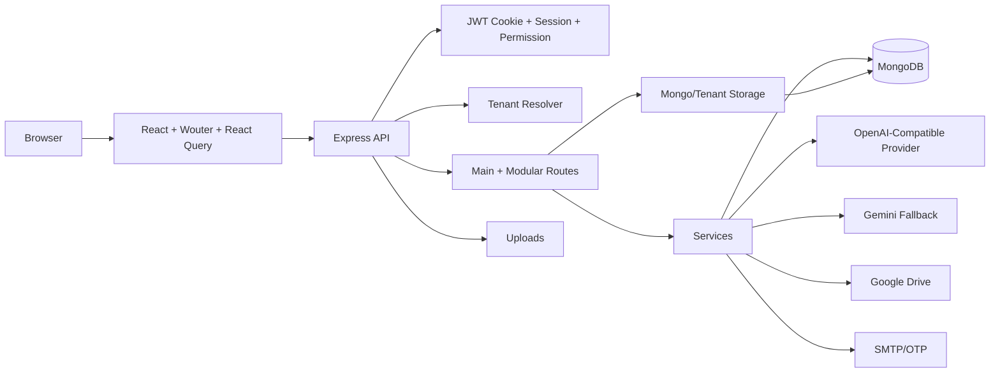

# Application Architecture — HMPS New

HMPS New is a pragmatic full-stack TypeScript monolith with React frontend and Express backend.

## System Flow

## Route Architecture

- `server/routes.ts`: main route registration for auth, users, berita, library, events, organization, settings, prodi, community, upload, backup, ops.
- `server/routes/store.ts`: store/toko domain.
- `server/routes/chat.ts`: AI chat domain using the primary OpenAI-compatible provider, then Gemini fallback.
- `server/routes/comments.ts`: comments.
- `server/routes/feedback.ts`: feedback and bug report.
- `server/routes/sharing.ts`: collaborative access requests.
- `server/routes/notifications.ts`: SSE preferences and web push.

## Frontend Architecture

- Wouter routes are ordered so static public/dashboard/store routes are evaluated before dynamic community `/:slug/*`.
- Dashboard routes are wrapped by `ProtectedRoute`.
- Public notification stream is mounted globally but skipped for dashboard/auth/error/tenant paths.
- Store supports `/toko` and a configurable custom navbar path from `/api/store/public/settings`.

## Data Architecture

- Main data uses MongoDB/Mongoose models and storage abstraction.
- Tenant data uses tenant resolver and tenant storage/db models.
- Shared types/utilities live in `shared/` only if safe for frontend and backend.

## Cross-Cutting Modules

| Module | Concern |
|--------|---------|
| Auth | session, JWT cookie, permission |
| Tenant | community slug, isolated DB, tenant route context |
| Media | upload, image process, Google Drive |
| Store | products, cart, checkout, orders, pricing |
| AI | OpenAI-compatible primary provider, Gemini key slots fallback, chat service, permission tools |
| Notifications | SSE, web push, preferences |
| Ops | backup, restore OTP, cleanup, security middleware |
