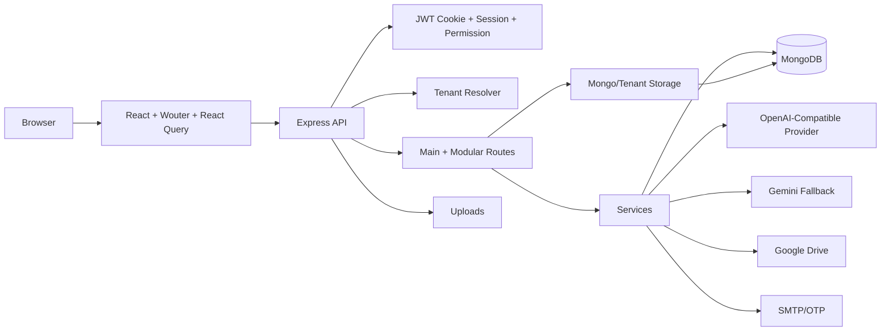

# Application Architecture — HMPS New

HMPS New is a pragmatic full-stack TypeScript monolith with React frontend and Express backend.

## System Flow

## Route Architecture

- `server/routes.ts`: main route registration for auth, users, berita, library, events, organization, settings, prodi (incl. student hub/calendar), community, upload, backup, ops.
- `server/routes/store.ts` (+ `store-logic.ts`): store/toko domain.
- `server/routes/chat.ts`: AI chat (OpenAI-compatible primary, Gemini fallback).
- `server/routes/ai-enhance.ts`: content enhance (`/api/ai/*`).
- `server/routes/comments.ts`: comments.
- `server/routes/feedback.ts`: feedback and bug report.
- `server/routes/sharing.ts`: collaborative access invite/request/decision.
- `server/routes/notifications.ts`: SSE preferences and web push.
- `server/routes/social-feed.ts`: home YT/IG social feed cache/manage/sync.
- `server/routes/system-errors.ts`: automatic bug monitoring (capture + owner manage/AI analyze).
- Sidecar: `server/banner-render-service.ts` for banner template render.

## Frontend Architecture

- Wouter routes are ordered so static public/dashboard/store routes are evaluated before dynamic community `/:slug/*`.
- Dashboard routes are wrapped by `ProtectedRoute`.
- Public notification stream is mounted globally but skipped for dashboard/auth/error/tenant paths.
- Store supports `/toko` and a configurable custom navbar path from `/api/store/public/settings`.
- Home can render social-feed sections; Prodi surfaces include student-hub content when configured.

## Data Architecture

- Primary schemas/models: `db/mongodb.ts` + types in `shared/schema.ts`.
- Extra models may live in `server/models/**` (not the only location).
- Tenant data uses tenant resolver and tenant storage/db models.
- Shared types/utilities live in `shared/` only if safe for frontend and backend.

## Cross-Cutting Modules

| Module | Concern |
|--------|---------|
| Auth | session, JWT cookie, permission |
| Tenant | community slug, isolated DB, tenant route context |
| Media | upload, image process, Google Drive, banner-render sidecar |
| Social feed | YT/IG scrape cache, soft-fail, manage/sync |
| Store | products, cart, checkout, orders, pricing, shipping |
| AI | OpenAI-compatible primary, Gemini fallback, chat tools, content enhance |
| Notifications | SSE, web push, preferences |
| Monitoring | system-errors capture (server/client), owner dashboard, AI analyze |
| Prodi hub | student hub calendars/portals/guides, sync jobs |
| Ops | backup, restore OTP, cleanup, security middleware, file scanner |

Terakhir diperbarui: 2026-08-06 · App version: lihat `docs/version/versions.md`
