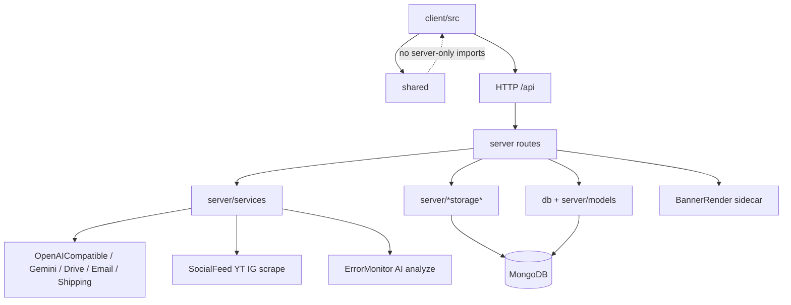

# Dependency Graph & AI Context

## Graph First Rule

When MCP is available, use Code Review Graph before manual file scanning:

| Task | Preferred Tool |
|------|----------------|
| Find feature code | `semantic_search_nodes` |
| Trace imports/callers | `query_graph` |
| Review changes | `detect_changes` + `get_review_context` |
| Impact analysis | `get_impact_radius`, `get_affected_flows` |
| Architecture view | `get_architecture_overview`, `list_communities` |

## Manual Dependency Map

## Rules

- Frontend never imports backend server files directly.
- `shared/` must remain safe for frontend bundle.
- Tenant-aware services must receive trusted tenant context from server resolver.
- Route modules may orchestrate, but reusable logic belongs in service/storage/helper.
- Social-feed / Prodi scrape must soft-fail; error-monitor capture must be best-effort.
- Banner-render is a separate process when enabled (`npm run start:banner-render`).

## Graph UI Preference

Keep `.code-review-graph/graph.html` behaviors:

- Reset restores all nodes/edges and clears state.
- Flow dropdown strictly filters selected subgraph.
- Re-apply custom behavior if graph visualization regenerates and removes it.
