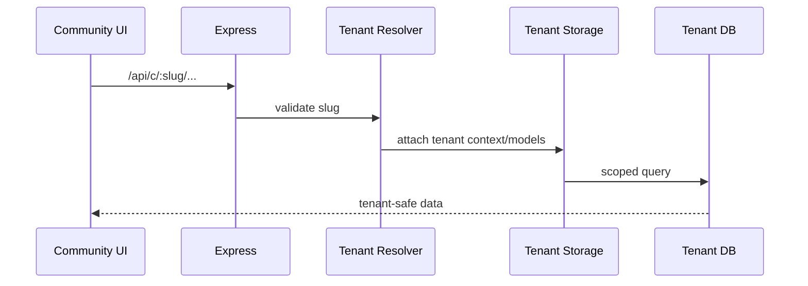

# Multi-Tenant Architecture — HMPS Community

## Contexts

| Context | UI | API | Storage |
|---------|----|-----|---------|
| Main HMPS | `/...` | `/api/...` | main DB/storage |
| Community Tenant | `/:slug/*` | `/api/c/:slug/*` | tenant DB/storage |

## Flow

## Rules

- Slug must be resolved by server, not trusted from request body.
- Tenant database name/model set comes from trusted registry.
- Main and tenant data must not be mixed accidentally.
- Global-only operations must explicitly reject tenant context.
- Tenant deletion/restore flows require OTP or owner-level authorization.

## Home / provisioning defaults

- New tenants seed `homeConfig` from `DEFAULT_TENANT_HOME_CONFIG` (no Prodi) via `initializeTenantSettings` in `server/tenant-storage.ts`.
- Blank tenant settings also force empty `aboutPageIntro`, `aboutPageTrackRecord`, `visionMission` (no Himatif seed).
- `navbarBrand` uses full community name (not truncated to 10 chars).
- Public home (`client/src/pages/index.tsx`): if tenant and `homeConfig.blocks` is empty, fallback to `DEFAULT_TENANT_HOME_CONFIG`, **not** main `DEFAULT_HOME_CONFIG`.
- Shared feedback/security code paths apply equally to `/api/feedback` and `/api/c/:slug/feedback`.

## Public URL, SEO, logo, auth

- Public path helper: `shared/tenant-paths.ts` (`prefixPublicPath`, `publicAbsoluteUrl`, reserved slugs including `toko`).
- Tenant public URLs are `/{slug}/...` (contoh `/ontakiuinmalang/berita/{article}`). Canonical/og:url/JSON-LD tidak boleh mengarah ke `/berita/...` utama.
- SSR production injects tenant `siteName` / `logoUrl` for `/:slug` and nested public pages.
- Sitemap includes active tenant landing + tenant berita. `/api/info` returns `{ slug, name, isTenant }`.
- Navbar shows `settings.logoUrl` when set. Favicon on tenant shell follows logo.
- Himatif copy/logo fallback is **main-only**. Tenant empty fields use empty-state or `siteName`.
- Auth: JWT main tidak di-resolve sebagai user tenant. `GET /api/c/:slug/auth/me` 401 = logged out di tenant UI (tidak fallback `/api/auth/me`).
- `GET /api/prodi` 404 on tenant. Reserved slug list used at register (server + client).
- `App.tsx` tidak menunggu `/api/store/public/settings` (main) untuk path tenant-like (`getTenantSlugFromPathname`). Path `/:slug` bukan toko dinamis.
- Slug komunitas tidak valid: `CommunityShell` tampil 404 **tanpa** auto-redirect ke beranda Himatif (`NotFound redirectTo={null}`).
- Query store settings tenant punya timeout 8s; gagal → fallback `/toko` (bukan spinner abadi).
- Breadcrumb di dalam `CommunityShell` harus `href="/"` (wouter base), bukan `basePath` absolut — hindari `/:slug/:slug`.
- Hero tenant tanpa banner: `logoUrl` atau kosong. `DEFAULT_IMAGE_URL` Himatif hanya fallback main.

## Tenant-Aware Feature Checklist

- [x] Works on main path if expected.
- [x] Works on `/api/c/:slug/*` if expected.
- [x] Invalid slug returns safe error.
- [x] Tenant A cannot read/write Tenant B data.
- [x] Upload paths and media URLs are scoped safely.
- [x] Notifications/chat/sharing do not cross tenant boundary.
- [x] Empty tenant `homeConfig` does not render main-only sections (e.g. Prodi).
- [x] Public canonical/sitemap/logo are tenant-scoped.

## Key Files

- `server/middleware/tenant-resolver.ts`
- `server/tenant-storage.ts`
- `db/tenant.ts`
- `shared/tenant-paths.ts`
- `client/src/hooks/use-public-brand.ts`
- `client/src/pages/community/index.tsx`
- `client/src/pages/index.tsx`
- `shared/schema.ts` (`DEFAULT_TENANT_HOME_CONFIG`)
- `server/routes.ts`
- `server/index.ts` (SSR + sitemap)

