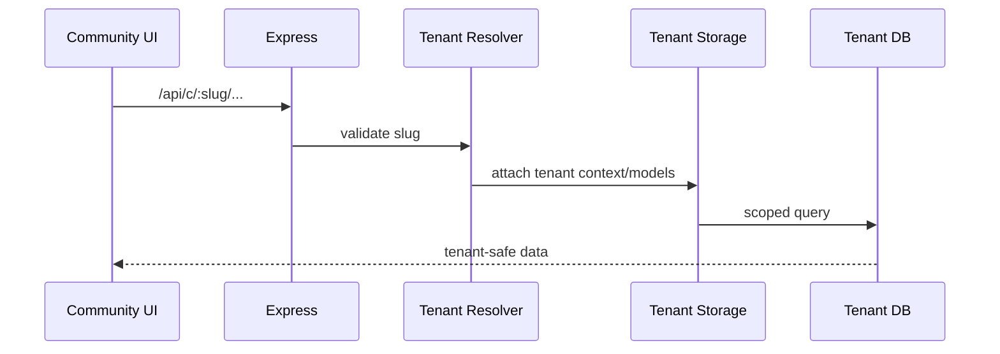

# Multi-Tenant Architecture — HMPS Community

## Contexts

| Context | UI | API | Storage |
|---------|----|-----|---------|
| Main HMPS | `/...` | `/api/...` | main DB/storage |
| Community Tenant | `/:slug/*` | `/api/c/:slug/*` | tenant DB/storage |

## Flow

## Rules

- Slug must be resolved by server, not trusted from request body.
- Tenant database name/model set comes from trusted registry.
- Main and tenant data must not be mixed accidentally.
- Global-only operations must explicitly reject tenant context.
- Tenant deletion/restore flows require OTP or owner-level authorization.

## Tenant-Aware Feature Checklist

- [ ] Works on main path if expected.
- [ ] Works on `/api/c/:slug/*` if expected.
- [ ] Invalid slug returns safe error.
- [ ] Tenant A cannot read/write Tenant B data.
- [ ] Upload paths and media URLs are scoped safely.
- [ ] Notifications/chat/sharing do not cross tenant boundary.

## Key Files

- `server/middleware/tenant-resolver.ts`
- `server/tenant-storage.ts`
- `db/tenant.ts`
- `client/src/pages/community/index.tsx`
- `server/routes.ts`
