# Feature Summary - HMPS Project HIMATIF ENCODER

> Source of truth fitur HMPS New berdasarkan audit route backend, frontend pages, services, storage, dan docs arsitektur. Dokumentasi ini tidak mengambil konteks dari folder `E-Commerce/`.

---

## Status Legend

| Status | Meaning |
|--------|---------|
| Active | Sudah ada implementasi aktif di codebase |
| Partial | Ada sebagian implementasi atau response shape perlu runtime verification |
| Docs | Dokumentasi, inventory, atau operational guide |
| Sensitive | Menyentuh auth/security/tenant/data/media/backup |

---

## Documentation Purpose

| Document | Purpose |
|----------|---------|
| `feature-summary.md` | Peta utama seluruh fitur HMPS, kategori, route/page/service coverage |
| `feature-template.md` | Standar penulisan feature doc baru dengan observed contract dari code |
| `docs/api/endpoints.md` | Inventory endpoint HTTP berdasarkan Express routes |
| `docs/SOP/*.md` | Aturan kerja development, coding, API, error handling, security |
| `docs/architecture/*.md` | Struktur aplikasi, dependency rules, multi-tenant, dan code-review graph |
| `docs/todo/master-todo.md` | Tracking pekerjaan docs/maintenance berikutnya |

---

## Folder Structure

```text
docs/features/
|-- feature-summary.md
|-- feature-template.md
|-- 01-auth-access/              # auth, sessions, users, roles, permissions, OTP/email
|-- 02-public-content/           # home, berita, profil, SSR/sitemap
|-- 03-events-library/           # event years, events, library, relation, folder files
|-- 04-organization-prodi/       # organization, members, prodi, sync, auto-fill
|-- 05-community-tenant/         # community listing, registration, tenant API/storage, delete OTP
|-- 06-store-toko/               # storefront, product, cart, checkout, order, shipping
|-- 07-media-assets/             # upload, editor media, home images, Drive, scanner, cleanup
|-- 08-collaboration-feedback/   # comments, feedback, bug report, sharing workflow
|-- 09-ai-notifications/         # Gemini chat, AI tools, recommendations, SSE, webpush
|-- 10-ops-security/             # middleware, backup/restore, API docs, deploy/scheduler
|-- 11-auxiliary-runtime/        # frontend inventory, aliases, utilities, error pages
`-- 12-runtime-infrastructure/   # middleware/config/bootstrap/helper infrastructure
```

---

## Feature Map

```mermaid
mindmap
  root((HMPS New))
    Auth Access
      Login Logout
        Login Targets
        JWT Cookie Session
        Logout
      Session Management
        Active Sessions
        Revoke Session
        Revoke All Sessions
      OTP Password Email
        Forgot Password Request OTP
        Verify OTP
        Confirm Reset
        Change Password
        Change Email
      Profile Management
        Update Username
        Update Name
        Division Label
      Users
        CRUD Users
        Password Admin Reset
        Email Admin Update
        Role Assignment
        Permission Overrides
      Roles Permissions Divisions
        Role Levels
        Assignable Roles
        Permission Catalog
        Owner Recompute
        Division Ordering
      Email OTP Services
        OTP Challenge
        Rate Limit
        SMTP Delivery
    Public Content
      Homepage Settings Stats
        Site Settings
        Home Config
        Home Image Slots
        Public Stats
        Dashboard Stats
        Activity Log
      Berita CMS
        Public List
        Slug Detail
        Manage List
        Create Update Delete
        Attach Event
        Related Berita
      Profil Page
        Public Profil
        Dashboard Profil
        Filosofi Upload
      SSR Sitemap
        Sitemap XML
        SPA Direct Load
        SEO Routes
    Events Library
      Event Years
        Year Archive
        Activate Deactivate
        Event Count
      Events Public CMS
        Published Events
        Active Home
        By Year
        Slug Detail
        CRUD Events
      Event Berita Relations
        Copy Event To Berita
        Copy Berita To Event
        Attach Detach Relations
        Copy Attachments
      Library Public CMS
        Public Library
        Manage Library
        Slug Detail
        CRUD Library
      Library Folder Files
        Google Drive Folder Files
        Visibility Access
    Organization Prodi
      Organization Periods Positions
        Periods
        Positions
        Position Copy
      Organization Members
        Member List
        Member Detail
        CRUD Members
      Structure Copy AutoFill
        Structure Copy
        Auto Fill Preview
        Apply Auto Fill
      Prodi Public Manage
        Public Prodi
        Preview
        Manage Update
      Curriculum Lab Lecturer
        Curriculum Year
        Lecturer Detail
        Lab Detail
      Prodi Sync Media
        Photo Member
        Photo Lab
        Photo Org Structure
        Sync Run
      Prodi Sync Service
        Remote Fetch
        Image Download
        Sync Summary
      Organization Auto Fill Service
        Structure Parser
        Generated Proposal
        Apply Result
    Community Tenant
      Community Listing Shell
        Public Communities
        Community Shell
        Slug Routing
      Registration Codes
        List Codes
        Create Code
        Patch Code
        Revoke Code
        Permanent Delete
      Registration Submit Flow
        Validate Code
        Upload Document Logo
        Create Community
      Registration Community Admin
        List Communities
        Health Check
        Update Community
        Repair Community
      Tenant API Storage
        /api/c/:slug
        Tenant Resolver
        Tenant Storage
        Tenant DB Isolation
      Delete OTP Repair
        Admin Delete OTP
        Owner Delete OTP
        Verify Reset Token
        Drop Tenant DB
    Store Toko
      Public Storefront Settings
        Public Settings
        Admin Settings
        Custom Store Path
      Products Categories
        Public Products
        Product Detail
        Admin Product CRUD
        Categories
        Product Reorder
      Bundles Campaigns
        Public Bundles
        Campaigns
        Admin Bundle CRUD
        Admin Campaign CRUD
      Cart Bundle Cart
        Cart Items
        Bundle Items
        Cart Draft
      Checkout Buy Link
        Checkout
        Direct Checkout
        Buy Link
        Server Recomputed Totals
      Orders Invoices
        My Orders
        Order Detail
        Admin Orders
        Status Update
        Bulk Delete
      Shipping Regional
        Shipping Quote
        Province Regency District Village
        External API
      Admin Store Operations
        Access Summary
        Store Admin CRUD
      Store Media Shares
        Product Image Upload
        Product Shares
        GDrive Proxy Image
        Upload Cleanup
      Regional Shipping Services
        regional-api-co-id
        shipping-api-co-id
    Media Assets
      General Upload
        /api/upload
        Multer Validation
        Image Processing
      Editor Content Media
        Content Image
        Event Content Image
        Berita Attachment
        Filosofi Upload
      Prodi Organization Media
        Member Photo
        Lab Photo
        Org Structure Photo
      Home Images Banner Render
        Active Home Images
        Year Slots
        Person Slots
        Banner Render
      Google Drive
        Check Access
        Media URL
        Folder Contents
        Store GDrive Image
      File Scanner Cleanup
        Orphan Scan
        Store Cleanup
      Asset Cleanup Service
        Deprecated Cleanup Endpoint
        Runtime Upload Hygiene
      File Scanner Service
        Upload Tree Scan
        Referenced Asset Check
      Banner Theme Render Services
        Template Render
        Theme Derive
        Render Worker Invoke
    Collaboration Feedback
      Comments
        Public Comments
        Count
        Manage
        Moderate Delete
      Feedback Public Ratings
        Submit Feedback
        Public Display
        Ratings
        Own Update Delete
      Feedback Moderation Config
        Manage Feedback
        Reply Decision
        Config
        Footer Display
      Bug Reports
        Submit Bug Report
        Count List
        Status Reply Delete
      Sharing Workflow
        Invite User
        Request Access
        Decision
        Revoke Access
        Requestable Entities
      Sharing Notifications Summary
        My Summary
        Sharing Notifications
        Mark Read
        User Search
    AI Notifications
      Gemini Chat Sessions
        Chat Sessions
        Chat Messages
        History
        Debug API Keys
      AI Tools Recommendations
        Permission Aware Tools
        Code/Data Context
        Tool Results
      Chat Service
        Gemini Call
        Message Persistence
        Context Handling
      Recommendation Service
        Context Recommendations
      Notification Stream
        SSE Stream
        Stream Stats
        Connection Lifecycle
      Preferences WebPush
        Preferences
        VAPID Key
        Subscribe Unsubscribe
      Notification Orchestrator Service
        Broadcast
        Tenant Context
        Event Triggered Notifications
    Ops Security
      Security Middleware
        Helmet HPP
        Anti Spoofing
        Injection Protection
        Upload Security
      Runtime Middleware Settings
        Get Settings
        Update Settings
        Dashboard Toggles
      Backup Restore
        Monthly Backup
        Manual Backup
        Restore Request OTP
        Restore Confirm
      Cleanup Migration
        Assets Cleanup
        Community Media Migration
      API Docs Swagger
        OpenAPI JSON
        Static HTML Docs
        Swagger UI Assets
      Deployment Scheduler
        Dev Server
        Production Build
        Cron Jobs
        Nginx Config
    Auxiliary Runtime
      Error Not Found Pages
      Artikel Detail Alias
      Store Pricing Currency Discount Utilities
      Embed Hosts Media Utilities
      Dashboard Spyro Context
      Frontend Route Page Inventory
      Frontend Auth Guards Session UI
      Dashboard Shell Editor Components
      Public UI Components
      Client Hooks Utilities
    Runtime Infrastructure
      Security Middleware Modules
        Anti Spoofing Protection
        API Protection
        DDoS Protection
        DNS Layer Protection
        Load Shedding
        Public Rate Limit
        Registration Attempts
        SQL Injection Protection
      Gemini Runtime Config
        Gemini Config
        Gemini Key Slots
        Trusted Network
      Database Bootstrap Backup Clients
        Mongo Seed
        Backup Client
        Backup Service
      Backend Relation Display Helpers
        Banner Render Service
        Event Attachments
        Library Relations
        User Display
      Frontend Constants Formatting
        Default Image
        Format Content
      Runtime Cache Query IP Helpers
        Client IP
        Mongo Query Limits
        Public JSON Cache
        Short Cache
      Web Push Service Worker Types
        Push Service Worker
        Web Push Types
        ClamScan Types
      Dev Swagger Runtime Entry Helpers
        Server Entry
        Vite Integration
        Swagger Helper
        Upload Pipeline
        Google Drive
        Image Processor
        Tenant Storage
```



---

## Category Index

| # | Category | Feature Docs | Main UI | Main API / Source | Status |
|---|----------|--------------|---------|-------------------|--------|
| 01 | [Auth & Access](./01-auth-access/00-README.md) | 8 | `/login`, `/forgot-password`, dashboard users/roles/profile | `/api/auth`, `/api/users`, `/api/roles`, `/api/permissions`, OTP/email services | Active Sensitive |
| 02 | [Public Content & CMS](./02-public-content/00-README.md) | 4 | `/`, `/berita`, `/profil`, dashboard content | `/api/berita`, `/api/settings`, `/api/stats`, SSR routes | Active |
| 03 | [Events & Library](./03-events-library/00-README.md) | 5 | `/events`, `/library`, dashboard events/library | `/api/events`, `/api/event-years`, `/api/library` | Active |
| 04 | [Organization & Prodi](./04-organization-prodi/00-README.md) | 8 | `/kelembagaan`, `/prodi`, dashboard pages | `/api/organization`, `/api/prodi`, prodi sync, auto-fill service | Active |
| 05 | [Community Tenant](./05-community-tenant/00-README.md) | 6 | `/communities`, `/register`, `/:slug/*` | `/api/registration`, `/api/register`, `/api/c/:slug`, tenant storage | Active Sensitive |
| 06 | [Store / Toko](./06-store-toko/00-README.md) | 10 | `/toko`, custom store path, `/dashboard/toko` | `/api/store`, regional/shipping services, shared store utilities | Active |
| 07 | [Media & Assets](./07-media-assets/00-README.md) | 9 | dashboard upload/content/media surfaces | `/api/upload`, `/api/gdrive`, `/api/home-images`, scanner/cleanup/render services | Active Sensitive |
| 08 | [Collaboration, Feedback & Sharing](./08-collaboration-feedback/00-README.md) | 6 | feedback widget/dashboard/content sharing | `/api/comments`, `/api/feedback`, `/api/sharing` | Active |
| 09 | [AI Chat & Notifications](./09-ai-notifications/00-README.md) | 7 | chat/notification prompt/stream | `/api/chat`, `/api/notifications`, AI/recommendation/orchestrator services | Active Sensitive |
| 10 | [Ops, Security & Maintenance](./10-ops-security/00-README.md) | 6 | dashboard settings, ops/admin flows | `/api/backups`, `/api/assets`, middleware, deploy/scheduler | Active Sensitive |
| 11 | [Auxiliary Runtime](./11-auxiliary-runtime/00-README.md) | 10 | frontend route inventory, error/alias pages, support components/hooks | page files, shared utility modules, client support layer | Active Docs |
| 12 | [Runtime Infrastructure](./12-runtime-infrastructure/00-README.md) | 8 | no direct UI; cross-cutting runtime layer | server middleware/config/db/helpers/cache/types/dev runtime, client constants/utils | Active Sensitive |

Total feature category folders: **12**  
Total markdown docs in `docs/features`: **101**  
Total numbered feature docs: **87**

---

## Frontend Route Coverage

| Area | Routes / Pages |
|------|----------------|
| Public content | `/`, `/berita`, `/berita/:id/:slug`, `/berita/:slug`, `/profil`, `/kelembagaan`, `/prodi` |
| Prodi detail | `/prodi/dosen/:slug`, `/prodi/curriculum/:slug`, `/prodi/laboratorium/:type/:index` |
| Events | `/events`, `/events/all`, `/events/:year`, `/events/:year/:eventId` |
| Library | `/library`, `/library/:id` |
| Store | `/toko`, `/toko/:slug`, `/toko/cart`, `/toko/orders`, `/toko/order/:orderNo`, custom store path variants |
| Auth | `/login`, `/forgot-password`, `/register`, `/error` |
| Dashboard | `/dashboard`, `/dashboard/berita`, `/dashboard/library`, `/dashboard/users`, `/dashboard/roles`, `/dashboard/settings`, `/dashboard/profil`, `/dashboard/kelembagaan`, `/dashboard/prodi`, `/dashboard/events`, `/dashboard/feedback`, `/dashboard/registration`, `/dashboard/toko` |
| Community | `/communities`, `/:slug`, `/:slug/*`, community shell pages |
| Explicit page inventory | [Frontend Route & Page Inventory](./11-auxiliary-runtime/06-frontend-route-inventory.md) |

---

## Backend / Service Coverage

| Surface | Count | Coverage |
|---------|-------|----------|
| Express route declarations | 284 | 0 missing after gap audit |
| Frontend page files | 39 | 0 missing after inventory doc |
| Frontend support components/hooks/libs | audited | documented in auxiliary runtime support docs |
| Runtime infrastructure files | audited | documented in runtime infrastructure docs |
| Dev/static/type support | audited | web push, type declarations, Vite, Swagger, upload/Drive/image helpers covered |
| Service files | 16 | 0 missing after service docs |
| Core API orchestration | `server/routes.ts` | auth, content, events, library, org, prodi, tenant, media, ops |
| Store router | `server/routes/store.ts` | store/toko public/admin/cart/checkout/order/regional/shipping |
| Modular routers | `chat`, `comments`, `feedback`, `sharing`, `notifications` | AI, collaboration, feedback, notification stream |
| Internal services | `server/services/*.ts` | OTP/email, backup, sync, AI, notification, media cleanup, banner render, shipping/regional |

---

## Cross-Cutting Requirements

| Requirement | Applies To |
|-------------|------------|
| Server-side permission | dashboard/admin/auth/store admin/media ops/backup |
| Tenant isolation | community shell, `/api/c/:slug`, tenant storage, tenant DB, media, notifications, sharing |
| Upload validation/cleanup | general upload, editor media, home images, store images, prodi media |
| Safe secret handling | Gemini, Google Drive, SMTP, JWT, OTP, Mongo/backup URI |
| Response accuracy | feature docs should use observed route contract, not invented examples |
| Docs update required | every new endpoint, page, service, or user-facing behavior change |

---

## Key Implementation Files

| Area | Files |
|------|-------|
| Main API | `server/routes.ts` |
| Modular APIs | `server/routes/store.ts`, `chat.ts`, `comments.ts`, `feedback.ts`, `sharing.ts`, `notifications.ts` |
| Frontend routing | `client/src/App.tsx` |
| Public pages | `client/src/pages/**` |
| Dashboard pages | `client/src/pages/dashboard/**` |
| Auth | `server/auth.ts`, `server/services/otp.ts`, `server/services/email.ts`, `client/src/components/auth/*` |
| Tenant | `server/middleware/tenant-resolver.ts`, `server/tenant-storage.ts`, `db/tenant.ts` |
| Data | `db/mongodb.ts`, `server/mongo-storage.ts`, `server/models/*`, `shared/schema.ts` |
| Media | `server/upload.ts`, `server/image-processor.ts`, `server/googleDrive.ts`, `server/services/file-scanner.ts`, `asset-cleanup.ts` |
| Store | `server/routes/store.ts`, `server/routes/store-logic.ts`, `shared/store-*`, shipping/regional services |
| AI/Notifications | `server/services/ai-tools.ts`, `chat-service.ts`, `recommendation.ts`, `notification-*` |
| Security/Ops | `server/security.ts`, `server/middleware/*`, `server/services/db-backup.ts`, `docs/openapi.json` |

---

## Maintenance Checklist

- Add/update feature doc when adding a route/page/service.
- Update `docs/api/endpoints.md` for endpoint changes.
- Update OpenAPI docs when public API contract changes.
- Update category `00-README.md` when adding feature docs.
- Run route/page/service coverage audit after large changes.
- Run `npm run check` before marking docs/code changes complete.

---

*Terakhir diperbarui: 2026-05-08*

