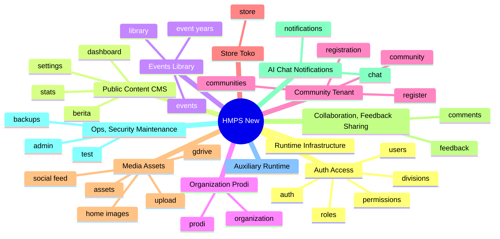

# HMPS Feature Summary

**Source of Truth**: current codebase + `docs/openapi.json` + feature docs.  
**App version (Current)**: see [`docs/version/versions.md`](../version/versions.md) (`4.16.0` at last docs sync).

This document maps HMPS user-facing features, backend endpoint families, frontend/runtime support layers, and operational infrastructure.

---

## Feature Map

---

## Category Index

| # | Category | Feature Docs | OpenAPI Ops | OpenAPI Tags |
|---|----------|--------------|-------------|--------------|
| 01 | [Auth & Access](./01-auth-access/00-README.md) | 9 | 43 | `auth`, `divisions`, `permissions`, `roles`, `users` |
| 02 | [Public Content & CMS](./02-public-content/00-README.md) | 5 | 26 | `berita`, `dashboard`, `settings`, `stats` |
| 03 | [Events & Library](./03-events-library/00-README.md) | 6 | 27 | `event-years`, `events`, `library` |
| 04 | [Organization & Prodi](./04-organization-prodi/00-README.md) | 9 | 27 | `organization`, `prodi` |
| 05 | [Community Tenant](./05-community-tenant/00-README.md) | 7 | 19 | `communities`, `community`, `register`, `registration` |
| 06 | [Store / Toko](./06-store-toko/00-README.md) | 11 | 57 | `store` |
| 07 | [Media & Assets](./07-media-assets/00-README.md) | 11 | 25 | `assets`, `gdrive`, `home-images`, `upload`, `social-feed` |
| 08 | [Collaboration, Feedback & Sharing](./08-collaboration-feedback/00-README.md) | 8 | 46 | `comments`, `feedback`, `system-errors`, `sharing` |
| 09 | [AI Chat & Notifications](./09-ai-notifications/00-README.md) | 9 | 17 | `chat`, `notifications`, `ai` |
| 10 | [Ops, Security & Maintenance](./10-ops-security/00-README.md) | 7 | 7 | `admin`, `backups`, `test` |
| 11 | [Auxiliary Runtime](./11-auxiliary-runtime/00-README.md) | 10 | 0 | - |
| 12 | [Runtime Infrastructure](./12-runtime-infrastructure/00-README.md) | 8 | 0 | - |

Public discovery (SSR / sitemap): [`02-public-content/04-ssr-sitemap.md`](./02-public-content/04-ssr-sitemap.md) — HTML prerender, `/sitemap.xml` image/video, `robots.txt`.

Total feature category folders: **12**  
Total markdown docs in `docs/features`: **114**  
Total numbered feature docs: **100**  
Total OpenAPI operations: **294**  
Total OpenAPI tags: **34**

---

## OpenAPI Coverage By Tag

| Tag | Category | Operations |
|-----|----------|------------|
| `auth` | [Auth & Access](./01-auth-access/00-README.md) | 18 |
| `divisions` | [Auth & Access](./01-auth-access/00-README.md) | 7 |
| `permissions` | [Auth & Access](./01-auth-access/00-README.md) | 2 |
| `roles` | [Auth & Access](./01-auth-access/00-README.md) | 7 |
| `users` | [Auth & Access](./01-auth-access/00-README.md) | 9 |
| `berita` | [Public Content & CMS](./02-public-content/00-README.md) | 15 |
| `dashboard` | [Public Content & CMS](./02-public-content/00-README.md) | 3 |
| `settings` | [Public Content & CMS](./02-public-content/00-README.md) | 7 |
| `stats` | [Public Content & CMS](./02-public-content/00-README.md) | 1 |
| `event-years` | [Events & Library](./03-events-library/00-README.md) | 7 |
| `events` | [Events & Library](./03-events-library/00-README.md) | 12 |
| `library` | [Events & Library](./03-events-library/00-README.md) | 8 |
| `organization` | [Organization & Prodi](./04-organization-prodi/00-README.md) | 16 |
| `prodi` | [Organization & Prodi](./04-organization-prodi/00-README.md) | 11 |
| `communities` | [Community Tenant](./05-community-tenant/00-README.md) | 1 |
| `community` | [Community Tenant](./05-community-tenant/00-README.md) | 3 |
| `register` | [Community Tenant](./05-community-tenant/00-README.md) | 3 |
| `registration` | [Community Tenant](./05-community-tenant/00-README.md) | 12 |
| `store` | [Store / Toko](./06-store-toko/00-README.md) | 57 |
| `assets` | [Media & Assets](./07-media-assets/00-README.md) | 1 |
| `gdrive` | [Media & Assets](./07-media-assets/00-README.md) | 3 |
| `home-images` | [Media & Assets](./07-media-assets/00-README.md) | 12 |
| `upload` | [Media & Assets](./07-media-assets/00-README.md) | 5 |
| `social-feed` | [Media & Assets](./07-media-assets/00-README.md) | 4 |
| `comments` | [Collaboration, Feedback & Sharing](./08-collaboration-feedback/00-README.md) | 6 |
| `feedback` | [Collaboration, Feedback & Sharing](./08-collaboration-feedback/00-README.md) | 23 |
| `system-errors` | [Collaboration, Feedback & Sharing](./08-collaboration-feedback/00-README.md) | 7 |
| `sharing` | [Collaboration, Feedback & Sharing](./08-collaboration-feedback/00-README.md) | 10 |
| `chat` | [AI Chat & Notifications](./09-ai-notifications/00-README.md) | 8 |
| `notifications` | [AI Chat & Notifications](./09-ai-notifications/00-README.md) | 8 |
| `ai` | [AI Chat & Notifications](./09-ai-notifications/00-README.md) | 1 |
| `admin` | [Ops, Security & Maintenance](./10-ops-security/00-README.md) | 2 |
| `backups` | [Ops, Security & Maintenance](./10-ops-security/00-README.md) | 4 |
| `test` | [Ops, Security & Maintenance](./10-ops-security/00-README.md) | 1 |

---

## Cross-Cutting Requirements

| Requirement | Applies To |
|-------------|------------|
| Server-side permission | dashboard/admin/auth/store admin/media ops/backup |
| Tenant isolation | community shell, `/api/c/:slug`, tenant storage, tenant DB, media, notifications, sharing |
| Upload validation/cleanup | general upload, editor media, home images, store images, prodi media |
| Safe secret handling | Gemini, Google Drive, SMTP, JWT, OTP, Mongo/backup URI |
| Response accuracy | feature docs should use observed route/OpenAPI contract, not invented examples |
| Docs update required | every new endpoint, page, service, runtime helper, or user-facing behavior change |
| Version bump required | setiap unit kerja selesai → `docs/version/release/` lengkap + sync package/OpenAPI version |

---

## Maintenance Checklist

- [ ] Update category feature doc when endpoint behavior changes.
- [ ] Update category `00-README.md` endpoint family tables when OpenAPI changes.
- [ ] Update OpenAPI endpoint coverage doc from `docs/openapi.json`.
- [ ] Update `docs/api/endpoints.md` and `docs/openapi.json` for public API changes.
- [ ] Run documentation coverage verification and `npm run check` when relevant.
